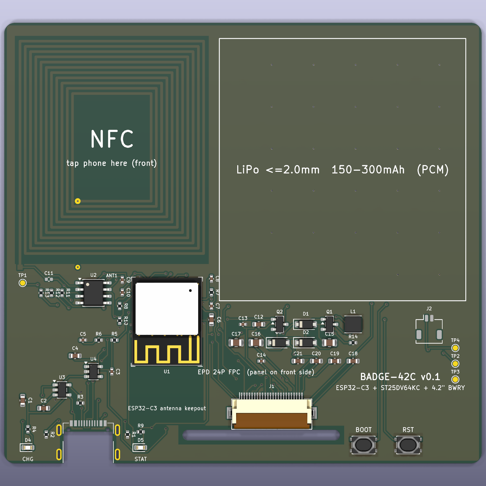

# chroma-badge（BADGE-42C）：4.2 寸四色墨水屏 NFC 工牌

> **当前：** [状态](docs/06-current-status.md) · [交接](docs/03-handoff.md) · [流程](docs/09-process.md)（许可证 / CI / 贴胶 / 生产包）。2026-09-14 复审是**旧 564 段板**档案，不要当现板。

仓库：https://github.com/wisdom-km/chroma-badge

一块 **6.3 mm 厚**的电子工牌：4.2" 黑白红黄四色墨水屏 + ESP32-C3（Wi-Fi/BLE/原生 USB）+ ST25DV64KC NFC + ≤2 mm 超薄锂电 + USB-C。固件目前是 v0.2 上电自检；手机传图（F2）未写。

| 背面 PCB 渲染 | 外壳（FreeCAD） |
|---|---|
|  | 见 `hardware/enclosure/output/badge_assembly.step` |

## 在本地接着做

```bash
git clone https://github.com/wisdom-km/chroma-badge.git
cd chroma-badge
```

用 Cursor **打开这个文件夹**（本地 Agent）。根目录 `AGENTS.md` 和 `.cursor/rules/badge.mdc` 会带上约定。

## 仓库

- `LICENSE.md`：硬件 CERN-OHL-P-2.0，固件/脚本 MIT
- `AGENTS.md`：硬性约定与当前进度
- `docs/01-architecture-decisions.md`：选型
- `docs/02-bom-and-cost.md`：BOM；屏贴胶 3M 467MP
- `docs/03-handoff.md`：复现步骤与**当前板**指纹
- `docs/09-process.md`：CI、生产包、贴胶
- `hardware/pcb/`：由 `scripts/design.py` 生成
- `firmware/README.md`：v0.2 自检；不要覆盖 `output/badge-42c-v0.1*.bin`

## 快速开始

全量 ERC/DRC 需要 KiCad **10.0.6**。不要把 `gen_pcb.py` 当日常命令（会清布线）。日常检查：

```bash
cd hardware/pcb
python3 scripts/check_netlist.py
./scripts/export.sh --check-only
```

自动布线流程见 `docs/03-handoff.md` 第 3 节。

## 状态

**H2（2026-09-15）：** 58 封装，PCB **680 段 / 115 过孔**，J1.7 NC。KiCad 10.0.6 全量 ERC/DRC 0。USB **0.8 mm**。固件 **v0.2 F1**。没有生产 zip。

下一步：打样实机；F2 须选定一条传图路线。

## 第三方内容

- 乐鑫 KiCad 库（ESP32-C3-MINI-1）：CC-BY-SA 4.0
- HRO TYPE-C-31-M-14 封装：jenschr/USB-C-Connectors，公有领域
- 其余符号/封装来自 KiCad 官方库
