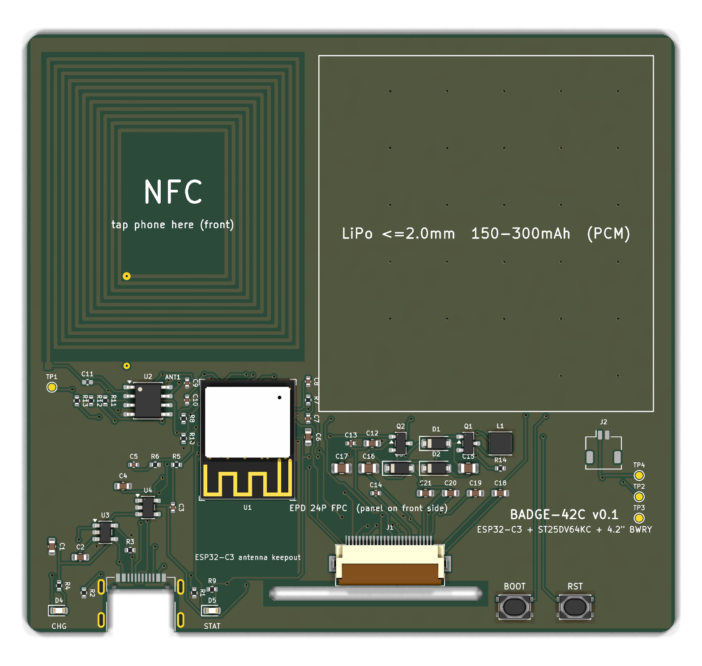
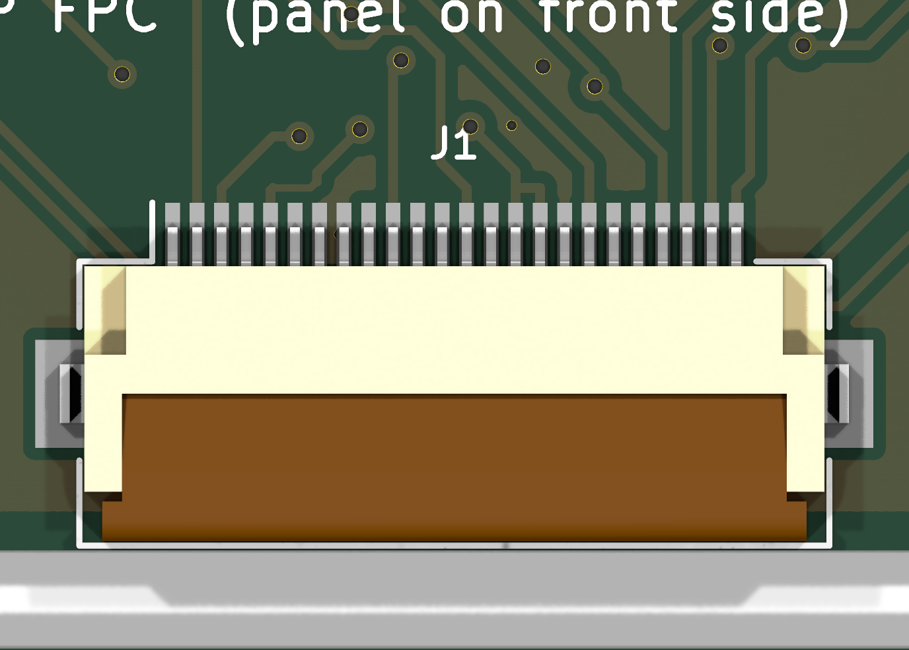
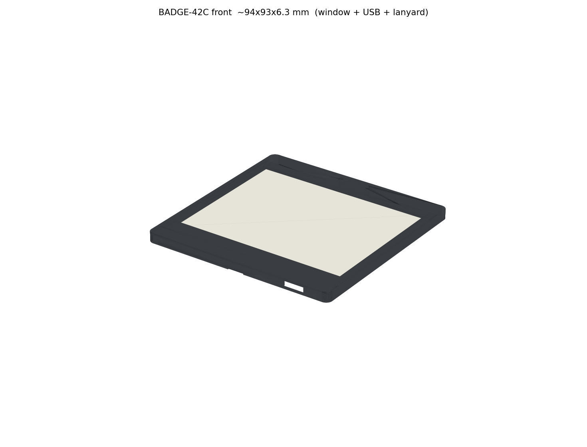

# 2026-09-14-r2 证据索引

隔离复跑目录：`agent-tools/review-20260914-234456`。本目录只收 **可入库的摘要与小文件**，不是生产包，也不覆盖 [首轮证据](../../2026-09-14/evidence/README.md)。大型 STEP/Gerber/SDK 留在 `agent-tools/`。

硬件/固件基准内容：`ee978f0`。审查时 HEAD：`11ab832`。

| 文件 | 用途 |
|---|---|
| [execution-summary.json](../execution-summary.json) | 退出码与“缺陷复现 vs 产品通过”区分 |
| [inputs.json](inputs.json) | 工作区 SHA256、起始 ` M badge.kicad_pro` / `?? tools/freerouting/` |
| [kicad-summary.json](kicad-summary.json)、[commands.json](commands.json) | 当次分类计数与命令返回码 |
| [erc-all.json](erc-all.json)、[erc-errors.json](erc-errors.json) | 全量 1 warning；error 0 |
| [drc-all-parity.json](drc-all-parity.json)、[drc-errors.json](drc-errors.json) | 148 warning；error/未连接 0 |
| [board-audit.json](board-audit.json) | 57/564/128、91×84×0.8、J2/J3 模型缺失、网络类别未进工程 |
| [extra-exports.json](extra-exports.json) | 诊断导出；B.Silk 归一化不相等 |
| [postprocess-summary.json](postprocess-summary.json) | 布线指纹三次相同 |
| [generators-summary.json](generators-summary.json) | 未跑 `gen_pcb.py` |
| [static.json](static.json) | AST、GPIO 映射、ZIP 内部一致、bin 哈希 |
| [firmware-clean-build.log](firmware-clean-build.log) | 干净目录构建 SUCCESS |
| [epd-probes.json](epd-probes.json)、[host-compile.log](host-compile.log) | 20 次替身；含假成功 |
| [faults.json](faults.json) | 旧 DRC 报告与 DRC 吞错 |
| [mechanical-*.json](mechanical-saved-step.json) | 10 组交叠 0；缺 FPC/真电池包络 |
| [original-export.log](original-export.log) | 原 export.sh：本轮 Git Bash 无 python3 |
| [step.log](step.log) | STEP 仍返回 0 |

预览是本轮新渲，不是实物照片：

