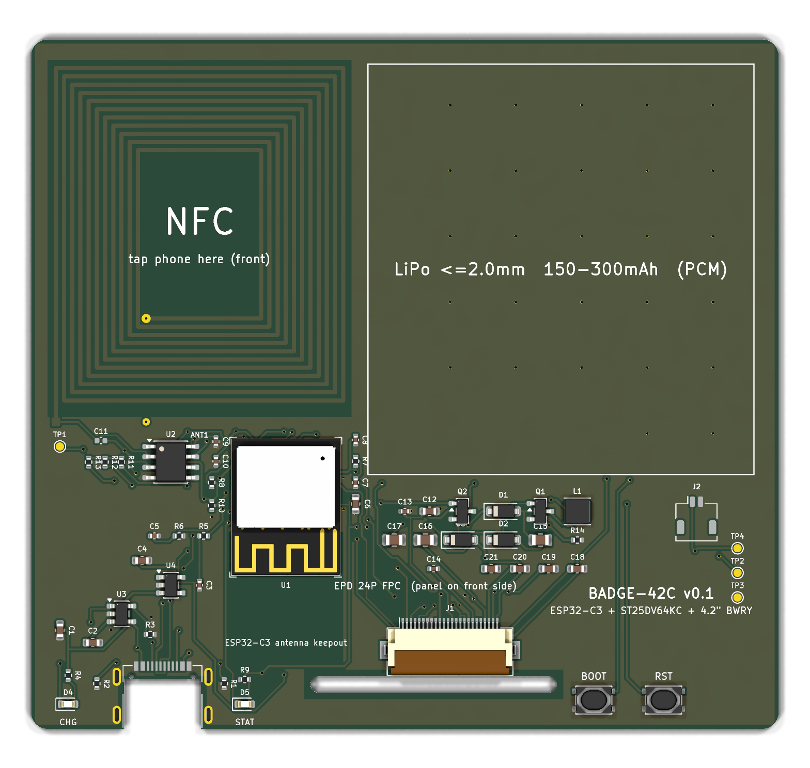
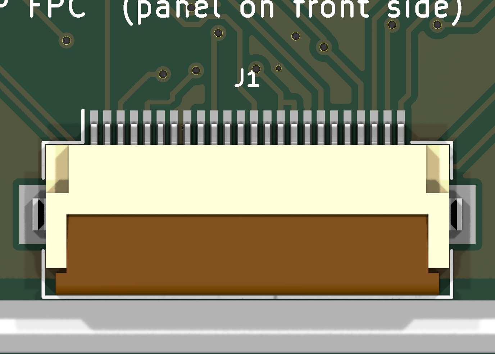
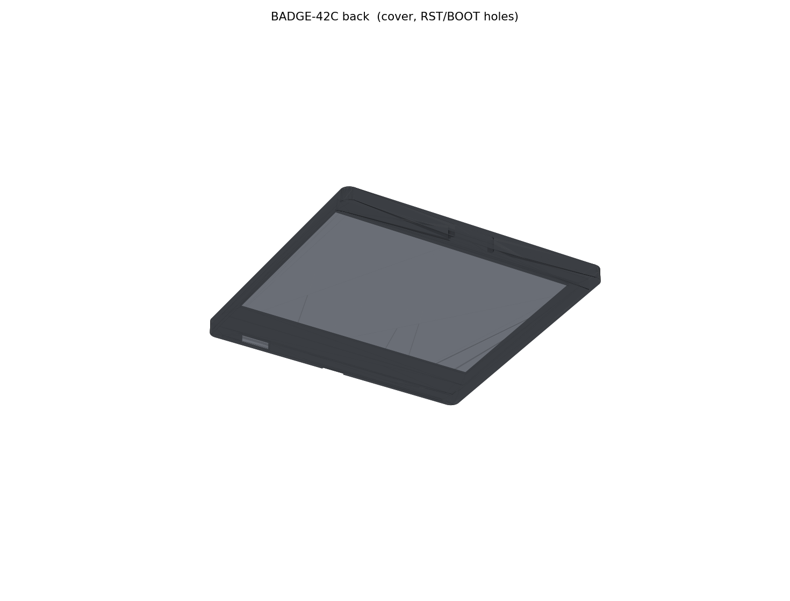

# 2026-09-14 本机复审证据索引

硬件/固件基准：`ee978f08cbdb7b61bbe2c78fea0e9c7cd2c34a7b`。本目录包含诊断证据，**不是生产发布包**。缺陷仍未修复，实机测试尚未执行。完整结论见 [独立复审](../local-review.md) 和 [合并计划](../integrated-plan.md)。

## 输入与完整性

| 文件 | 内容 |
|---|---|
| [inputs.json](inputs.json) | 审查开始时工作区已跟踪文件的SHA256/大小、源commit和起始状态；审查副本用提交版工程配置 |
| [sources.json](sources.json) | 用户原审查、确切屏PDF、KiCad安装包SHA256；屏PDF印刷日期2026/06/17、Revision1.0、40页；PDF未入库 |
| [preservation.json](preservation.json) | 确认所有原硬件/固件及其输出文件字节未变；保留起始本机`.kicad_pro`改动 |
| [manifest.json](manifest.json) | 本目录各证据文件SHA256和字节数；清单不包含自身 |

目录属性禁止Git换行转换，以便原始日志与报告SHA256在不同机器检出仍一致。`inputs.json`的输入哈希描述审查时的工作区字节，而非声称所有输入文件等于Git规范化blob字节。

## 检查结果与原始报告

| 文件 | 结果与用途 |
|---|---|
| [commands.json](commands.json)、[summary.json](summary.json) | 当次KiCad命令/返回值和全量分类统计 |
| [erc-all.json](erc-all.json)、[erc-errors.json](erc-errors.json) | 全量1警告，error0；U1库符号问题未关闭 |
| [drc-all-parity.json](drc-all-parity.json)、[drc-errors.json](drc-errors.json) | 64板级+84parity警告，error0、未连接0 |
| [drc-localsettings.json](drc-localsettings.json) | 起始本机未提交配置下error级DRC仍0；使用的是副本 |
| [netlist-check.log](netlist-check.log)、[netlist-export.log](netlist-export.log) | 新导出网表后运行原检查器，匹配设计、63原理图网络 |
| [generators-summary.json](generators-summary.json)、[generated-erc.json](generated-erc.json) | 原理图/NFC生成器真实复跑；网表匹配、error ERC0；NFC封装忽略换行相同 |
| [execution-summary.json](execution-summary.json) | 补充命令退出码与测试性质，区分产品通过与旧缺陷复现 |
| [board-audit.json](board-audit.json) | 57封装/564段/128孔/91×84×0.8mm、引脚映射、网络统计、模型缺项、NFC阻焊与未落地类别 |
| [postprocess-summary.json](postprocess-summary.json) | 原板→第一次→第二次`--skip-route`的路由指纹一致 |
| [postprocess-cycle-1.log](postprocess-cycle-1.log)、[postprocess-cycle-2.log](postprocess-cycle-2.log) | 原后处理过程，未启动Freerouting；日志里几何岛描述不是未连接判定 |
| [postprocess-cycle-1-drc.json](postprocess-cycle-1-drc.json)、[postprocess-cycle-2-drc.json](postprocess-cycle-2-drc.json) | 两次独立最终error报告，违规/未连接均空 |
| [static.json](static.json) | 9份原Python脚本AST、13个GPIO映射、BOM/位置、当前ZIP内部比较、三份固件哈希 |
| [firmware-clean-build.log](firmware-clean-build.log) | 全新目录编译，包括真实依赖/内存占用；三份bin与原版本字节一致 |
| [epd-probes.json](epd-probes.json)、[host-compile.log](host-compile.log) | 20次原EPD代码的替身调用；有两种已复现假成功；fake_elapsed_ms不是实测时间 |
| [faults.json](faults.json) | ERC进程失败可阻断；DRC失败被吞；`drc_json`返回旧报告的故障注入 |
| [original-export.log](original-export.log)、[bash-prerequisites.log](bash-prerequisites.log) | 原导出脚本实际执行到python3退出49；WindowsApps别名及缺zip，不是制造包生成成功 |

## 制造与机械

| 文件 | 结果与局限 |
|---|---|
| [extra-exports.json](extra-exports.json) | 原理图PDF/SVG、PCB SVG、裸板STEP命令成功；13份新旧Gerber/孔数据的日期归一化比较 |
| [manufacturing-diff.json](manufacturing-diff.json)、[back-silkscreen.diff](back-silkscreen.diff) | 旧背面丝印与新导出真实坐标不同；旧ZIP内部一致却仍带旧丝印 |
| [step.log](step.log) | J3、J2模型无法加入，但完整STEP命令仍返回0 |
| [mechanical-saved-step.json](mechanical-saved-step.json) | 既有STEP下实体有效、扩展10组交叠为0 |
| [mechanical-fresh-step.json](mechanical-fresh-step.json) | 新导出STEP下同样通过；缺实体仍不能检验相应干涉 |
| [enclosure-generation.log](enclosure-generation.log)、[enclosure-render.log](enclosure-render.log) | 原FreeCAD生成器/5张预览真正运行，产物都在副本 |

其他同名`.log`保留对应CLI原输出。大型STEP、生成器副本、SDK、安装包、厂商PDF和模拟可执行文件留在忽略目录，不入库。新生成的Gerber只是诊断，不覆盖原制造包；既有生产包的来源不因本报告而获得批准。

## 对准的预览

这些是本轮新生成图片，不是实物照片。J1特写已对准连接器和槽；J2/J3缺外形必须与模型解析日志结合看，不能推断没放PCB元件。FreeCAD两图用于看结构，严格干涉判断来自OCC数值。

## 复跑和判读

执行 [工具手册](../../../../tools/review/README.md)，每轮使用新的隔离目录。全量检查返回5表示发现违规，审查收集程序最终返回1是保留失败，不是测试工具意外全部崩溃。`host_probes`和`fault_probes`是旧缺陷特征测试；通过意味着缺陷被复现，修复后必须改成新的防回归预期。

能得出的结论：设计数据/当前error规则检查、编译及有限几何验证有证据；存在已确认缺陷和交付不同步。不能得出的结论：真实USB/显示/RF/充电/续航/装配已通过，或可立即生产。
